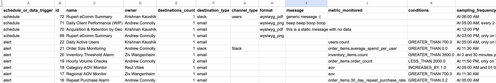

# Looker Alerts & Schedules Extraction Utility
A simple python utility for downloading details of all the alerts or schedules configured in your Looker instance.

Built by the team at Rupert. Tired of struggling with BI alerts and schedules? [We can help!](https://www.hirupert.com)


## What does the utility do?
It generates a csv file containing all the alerts and schedules found in your Looker instance. Point the utility at your Looker instance, pass it API credentials and you'll get a file that looks like this:



### Why?
Managing contnet in Looker is hard. Most instances are cluttered. Alerts and schedules serve a crucual data distribution function. This utility makes it easy to review and understand 

### Output Schema

| Field | Description |
| --- | --- |
| `schedule_or_data_trigger` | Two values: **alert** (data triggered) or **schedule** (time trigger) |
| `id` | The internal Looker id for the alert or schedule |
| `name` | The name of the alert or schedule. Alert names are blank in Looker by default. Schedule names default to the name of the dashboard |
| `owner` | The Looker user who created and owns the schedule or alert |
| `destinations_count` | How many different email addresses, Slack channels, or Slack users are recipients |
| `destination_type` | **slack** or **email** |
| `channel_type` | Two values: **Slack** (a Slack channel) or **users** (a Slack DM) |
| `format` | Schedules only. The type of content that is sent. |
| `message` | The static, plain-text message sent with the scheduled delivery. Alerts have no messages |
| `metric_monitored` | The metric that the alert is monitoring. Schedules don't monitor a specific metric. |
| `conditions` | Alerts only. The conditions and threshold values that determine if an alert triggers. |
| `sampling_frequency` | How often a scheduled dashboard is sent OR how often an alert's conditions are evaluated. |
| `source_tile_or_dashboard` | For alerts, this is the detail of the Looker tile the alert was added to. For schedules, this is the dashboard the schedule was set on. |
| `engagement_usage` | Looker doesn't provide any info on usage or engagement for alerts and schedules. |

## Getting Started
We use `pipenv` to manage our dependencies. To install the dependencies, run:

```bash
pipenv install
```

To run the script, run:

```bash
pipenv run python3 main.py
```

Environment variables are used to configure the script. The following environment variables are used:
- `LOOKER_API_BASE_URL`: The base URL of the Looker API. This is usually `https://<instance_name>.cloud.looker.com`.
- `LOOKER_CLIENT_ID`: The API client ID to use for the Looker instance.
- `LOOKER_CLIENT_SECRET`: The API client secret to use for the Looker instance.

If one or more of these environment variables are not set, the script will prompt you to enter them.

### Optional: Run the script with Replit
